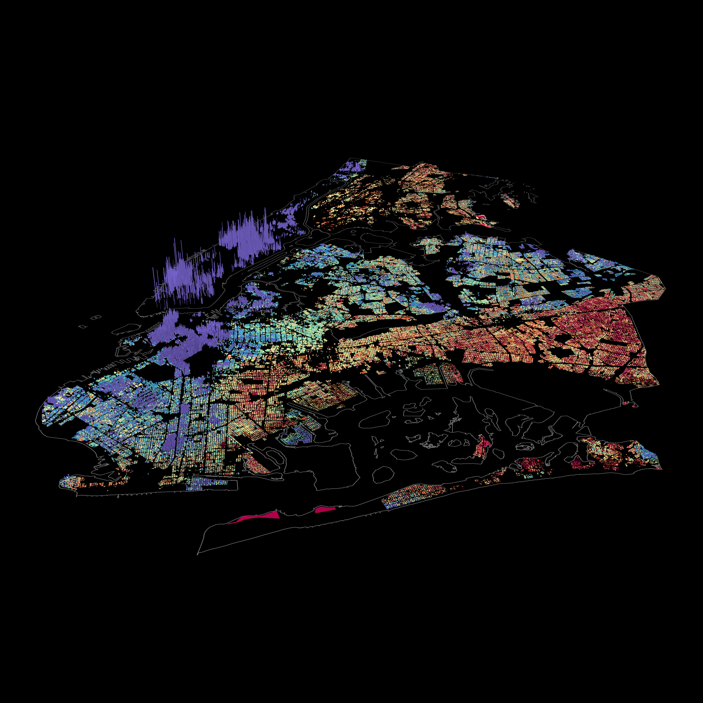

# nyc-tax-inequity
This project is an attempt to visualize inequities in NYC's property tax system, primarily the regressive effect of capping annual property tax increases. These property tax caps, sold as a way of protecting fixed income homeowners in rapidly appreciating neighborhoods, instead overwhelmingly benefit already wealthy property owners.

† https://papers.ssrn.com/sol3/papers.cfm?abstract_id=2377590<br />
† http://furmancenter.org/thestoop/entry/new-york-city-property-tax-reform<br />
† https://www.economist.com/finance-and-economics/2015/10/03/assessing-the-assessments<br />




## Explore the maps
[3D kepler.gl map](https://drive.google.com/file/d/1234Po1ge4IhH5a4svLkN-yvvVmQkIlNV/view?usp=sharing) (this one loads the entire dataset (~300 MB) client side, don't recommend this on mobile) 
[2D Carto map](https://ksheng.carto.com/builder/2a0665fd-a3ba-4c4a-9d27-198ca99fdf4c/embed)<br />

The interactive Carto map contains a superset of the columns used for the final map renderings for every class 1 building, so you can poke around and see where the numbers come from.

This is a 2D representation where the colors represent how many dollars the property tax cap saves the homeowner (which gets turned into the height dimension on the 3D map).

Hover over a BBL to see more metrics, which are explained below.

## What am I looking at?
The data backing these maps is derived by combining [John Krauss' scraped tax bills](taxbills.nyc), which contains the estimated market value and actual taxes paid, with geodata from the NYC Department of City Planning's [MapPluto 18v2](https://www1.nyc.gov/site/planning/data-maps/open-data/dwn-pluto-mappluto.page).

We find the actual dollar value saved because of these tax caps for every class 1 property in 2017 by calculating what the homeowner would have paid in taxes if the assessed value were not capped and simply the estimated market value multiplied by the 6% assessment ratio for class 1 properties.

As an alternate view, we also calculate the property value you are effectively paying taxes on (the "effective market value").

[For reference, this is random Notice of Property Value from the NYC Department of Finance.](content/nopv.pdf)

Here, you can see how taxes are calculated and how the 6% tax cap is applied.

Looking at this on the 2D map is not particularly revealing. The real impact comes from the 3D map, which plots the dollar value saved on the height dimension against market value decile on the color axis.

Here you can see that not only do higher value properties save more absolute dollars because of this policy (which is a rather trivial conclusion), but the massive disparity in *how much* they are saving.

Several properties benefit orders of magnitude more than most other properties, all these properties fall into the top 10 percent of most valuable homes (around $1 million+).

## Background
NYC property tax law is regressive in a number of different ways, worsening (and in turn made worse by) the housing crisis.

Landlords receive huge tax breaks for (often non existent) renovations in the form of abatements and exemptions or by converting their buildings to co-ops or condos (which are heavily favored by the tax code).

Shiny new high rises and mansions are often massively undervalued by the city when there are no comparable buildings nearby, again subsidizing the richest developers and homeowners.

Residental rental buildings bear a disproportionately large percentage of the cities' tax burden, which is more or less passed completely on to tenants, while landlords capture the benefits of massively appreciating neighborhood property values.

We tackle these issues in the other parts of this project, and they are discussed at length in many other articles and studies.

## Tax caps
For these maps, we narrowed the scope to one particularly inequitable part of NYC tax law: property tax caps.

Every year, the taxable value of an NYC apartment can increase a maximum of 6% (or 30% over five years). This means that if the building rapidly appreciates in value, the owner is shielded from the corresponding increase in property taxes through what is effectively a tax break from the government.

However, clearly, housing is not just a roof over our heads, it is a massively valuable [investment vehicle](http://cityobservatory.org/housing-cant-be-affordable_and_be-a-good-investment/).

The housing market in NYC is valued at over [1 trillion dollars](https://www1.nyc.gov/assets/finance/downloads/pdf/press_release/fy2017_tentative_assessment_roll.pdf), more or less *because* it has so much potential to appreciate and produce wealth for the exclusive few who enough capital to play.  

So, in a situation where appreciation in the housing market massively benefits the richest of the rich, who are the main beneficiaries of this policy?

## From tax bills to maps
Retrive the raw tax bills (~10.5 GB, 130M rows):
```
$ curl -O http://taxbills.nyc/rawdata.csv
```

Insert the csv into a postgres table:
```
$ psql -c 'drop table if exists rawdata cascade;'
$ psql -c 'create table rawdata (
         bbl bigint,
         activityThrough DATE,
         section TEXT,
         key TEXT,
         dueDate DATE,
         activityDate DATE,
         value TEXT,
         meta TEXT,
         apts TEXT
        );'
$ time psql -c "\\copy rawdata FROM 'rawdata.csv' WITH CSV HEADER NULL '' QUOTE '\"';"
```

```
$ xsv frequency rawdata.csv -s activityThrough
field,value,count
activityThrough,2017-06-02,28584244
activityThrough,2018-06-01,15532988
activityThrough,2015-06-05,15509053
activityThrough,2009-06-06,13890098
activityThrough,2016-06-03,11455436
activityThrough,2010-06-11,2429943
activityThrough,2009-11-20,2422271
activityThrough,2011-06-10,2416519
activityThrough,2011-11-18,2403325
activityThrough,2011-08-26,2333950
```

Filter only records from FY2017 since it has the most records.
```
SELECT * INTO TEMP fy2017 FROM rawdata where activityDate = '2017-06-02';
```

Pivot the table so that tax details go into columns:
```
SELECT * INTO details_crossed
FROM crosstab('select bbl, key, value from details where key = ''estimated market value'' or key = ''tax before exemptions and abatements'' or key = ''tax before abatements'' or key = ''annual property tax'' or key = ''tax class'' or key = ''current tax rate''order by 1, 2')
AS ct ("bbl" bigint, "estimated market value" text, "tax before exemptions and abatements" text, "tax before abatements" text, "annual property tax" text, "tax class" text, "current tax rate" text);
```

Save each borough as a separate CSV so they can be loaded into Carto's web interface:
```
\copy (SELECT * FROM details_crossed where LEFT(bbl::text, 1) = '1') TO '~/mntaxbills.csv' WITH CSV;
\copy (SELECT * FROM details_crossed where LEFT(bbl::text, 1) = '2') TO '~/bxtaxbills.csv' WITH CSV;
\copy (SELECT * FROM details_crossed where LEFT(bbl::text, 1) = '3') TO '~/bktaxbills.csv' WITH CSV;
\copy (SELECT * FROM details_crossed where LEFT(bbl::text, 1) = '4') TO '~/qntaxbills.csv' WITH CSV;
```

Download MapPLUTO data:
```
$ curl -o "#1mappluto.csv" https://common-data.carto.com/api/v2/sql?format=csv&q=select%20cartodb_id,%20the_geom,%20address,%20bbl,%20bldgarea,%20numbldgs,%20numfloors,%20ownername,%20unitsres,%20unitstotal,%20yearbuilt,%20zipcode%20from%20public.{mn,bx,bk,qn}mappluto
```
This command will download a separate csv for each borough, more amenable to Carto's API limits.
Instead of directly linking to the data library in Carto, I use their common data API to select the relevant columns and reupload the smaller table.

There is a unified download for all 5 boroughs at https://common-data.carto.com/tables/nycpluto_all/public but it is too large to upload to import into a Carto student account, and also has a slightly different schema.

Download PUMA data:
```
$ curl -o puma.geojson https://data.cityofnewyork.us/api/geospatial/cwiz-gcty?method=export&format=GeoJSON
```

You can explore the resulting CSVs using your tool of choice (I find xsv, SQLite, or csvkit + postgres usually work well, in order of complexity / "power").

At this point, all of these lables were loaded into Carto's web interface for visual exploration, using the following query to get the main metrics.
```
SELECT
 *
FROM (
SELECT
	row_number() over() as cartodb_id,
    the_geom,
    the_geom_webmercator,
    bbl,
  	numbldgs,
    property_tax,
    market_value,
    property_tax_noexempt / .06 / (LEFT(rate, 7)::float / 100) as effective_market_value,
  	address,
  	ownername,
  	bldgarea,
  	rate,
  	market_value / GREATEST(numbldgs, 1) as market_value_per_building,
    to_char(100.0*property_tax_noexempt / market_value,'999D9999%') as effective_rate,
  	((.06 * market_value * LEFT(rate, 7)::float / 100) - property_tax_noexempt) as benefit,
    CASE
    	WHEN SUBSTRING(class, 2, 1) = '1' THEN (property_tax / market_value) / (.06 * LEFT(rate, 7)::float / 100)
    ELSE (property_tax / market_value) / (.45 * LEFT(rate, 7)::float / 100)
	END as div,
    SUBSTRING(class, 2) as class
FROM (
  
  SELECT
    pluto.the_geom as the_geom,
    pluto.the_geom_webmercator as the_geom_webmercator,
    pluto.bbl as bbl,
  	pluto.bldgarea as bldgarea,
  	pluto.numbldgs as numbldgs,
    pluto.address as address,
  	pluto.ownername as ownername,
  	tb.tax_before_exemptions_and_abatements as property_tax_noexempt,
  	tb.tax_before_abatements as property_tax_noabate,
    tb.annual_property_tax as property_tax,
    tb.estimated_market_value as market_value,
    tb.current_tax_rate as rate,
    tb.tax_class as class
  FROM mnmappluto as pluto
  INNER JOIN mntaxbills AS tb
    ON pluto.bbl = tb.bbl
  
  UNION ALL
  
  SELECT
    pluto.the_geom as the_geom,
    pluto.the_geom_webmercator as the_geom_webmercator,
    pluto.bbl as bbl,
  	pluto.bldgarea as bldgarea,
  	pluto.numbldgs as numbldgs,
    pluto.address as address,
  	pluto.ownername as ownername,
  	tb.tax_before_exemptions_and_abatements as property_tax_noexempt,
  	tb.tax_before_abatements as property_tax_noabate,
    tb.annual_property_tax as property_tax,
    tb.estimated_market_value as market_value,
    tb.current_tax_rate as rate,
    tb.tax_class as class
  FROM bxmappluto as pluto
  INNER JOIN bxtaxbills AS tb
    ON pluto.bbl = tb.bbl
  
  UNION ALL
  
  SELECT
    pluto.the_geom as the_geom,
    pluto.the_geom_webmercator as the_geom_webmercator,
    pluto.bbl as bbl,
  	pluto.bldgarea as bldgarea,
  	pluto.numbldgs as numbldgs,
    pluto.address as address,
  	pluto.ownername as ownername,
  	tb.tax_before_exemptions_and_abatements as property_tax_noexempt,
  	tb.tax_before_abatements as property_tax_noabate,
    tb.annual_property_tax as property_tax,
    tb.estimated_market_value as market_value,
    tb.current_tax_rate as rate,
    tb.tax_class as class
  FROM bkmappluto as pluto
  INNER JOIN bktaxbills AS tb
    ON pluto.bbl = tb.bbl
  
  UNION ALL
  
  SELECT
    pluto.the_geom as the_geom,
    pluto.the_geom_webmercator as the_geom_webmercator,
    pluto.bbl as bbl,
  	pluto.bldgarea as bldgarea,
  	pluto.numbldgs as numbldgs,
    pluto.address as address,
  	pluto.ownername as ownername,
  	tb.tax_before_exemptions_and_abatements as property_tax_noexempt,
  	tb.tax_before_abatements as property_tax_noabate,
    tb.annual_property_tax as property_tax,
    tb.estimated_market_value as market_value,
    tb.current_tax_rate as rate,
    tb.tax_class as class
  FROM bkmappluto as pluto
  INNER JOIN bktaxbills AS tb
    ON pluto.bbl = tb.bbl
  
  UNION ALL
  
  SELECT
    pluto.the_geom as the_geom,
    pluto.the_geom_webmercator as the_geom_webmercator,
    pluto.bbl as bbl,
  	pluto.bldgarea as bldgarea,
  	pluto.numbldgs as numbldgs,
    pluto.address as address,
  	pluto.ownername as ownername,
  	tb.tax_before_exemptions_and_abatements as property_tax_noexempt,
  	tb.tax_before_abatements as property_tax_noabate,
    tb.annual_property_tax as property_tax,
    tb.estimated_market_value as market_value,
    tb.current_tax_rate as rate,
    tb.tax_class as class
  FROM qnmappluto as pluto
  INNER JOIN qntaxbills AS tb
    ON pluto.bbl = tb.bbl

) as fulldata
WHERE property_tax > 0
  AND market_value > 0
  AND bldgarea > 0
  AND numbldgs > 0
) t
WHERE div <= 1
	AND benefit > 0
    AND class = '1 - small home, less than 4 families'
```

The gentrifying neighborhoods are from [a Furman Center report](http://furmancenter.org/files/sotc/Part_1_Gentrification_SOCin2015_9JUNE2016.pdf).

"High value" neighborhoods:
```
SELECT *
FROM puma
WHERE puma::int
  IN (
    3810,
    4004,
    3807,
    4005,
    3806,
    4109
  )
 ```
 
"Gentrifying" neighborhoods:
```
SELECT *
FROM puma
WHERE puma::int
  IN (
	4001,
    3803,
    3809,
    4002,
    3804,
    3802,
    4003,
    4006,
    3801,
    3710,
    4101,
    4012,
    3705,
    4007,
    4011
  )
 ```
 
For the 3D rendering, the resultant table was exported as a GeoJSON and dumped into kepler.gl, with a solid black Mapbox basemap.

The output is rendered as a 10k x 10k resolution PNG.

